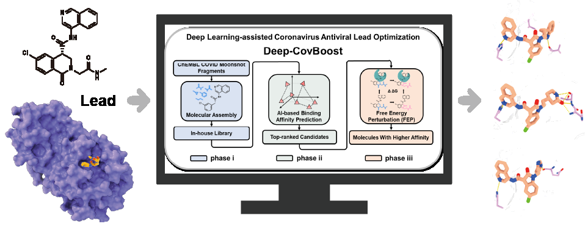
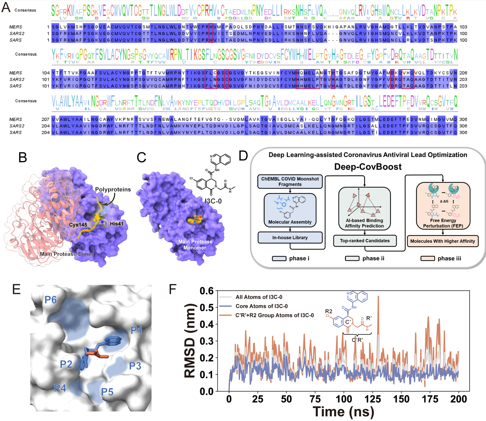
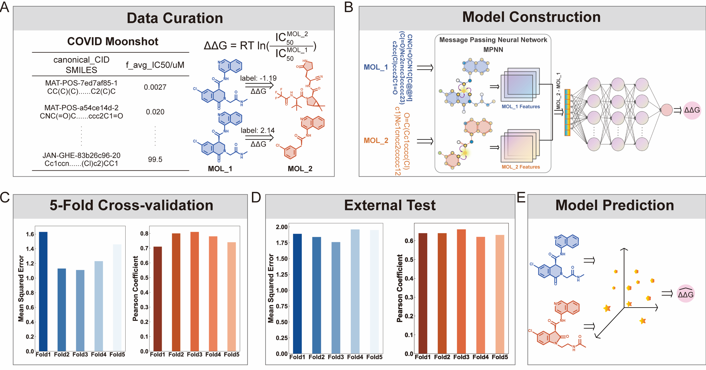
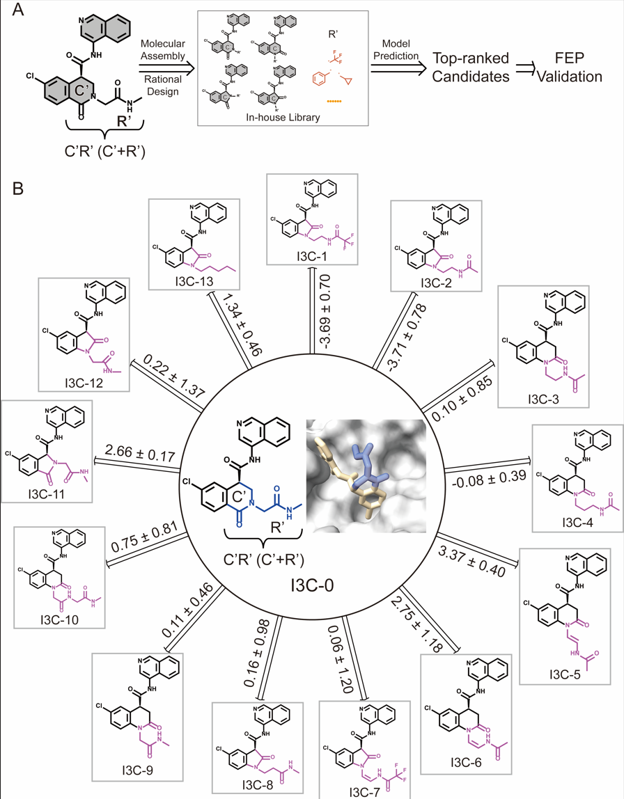
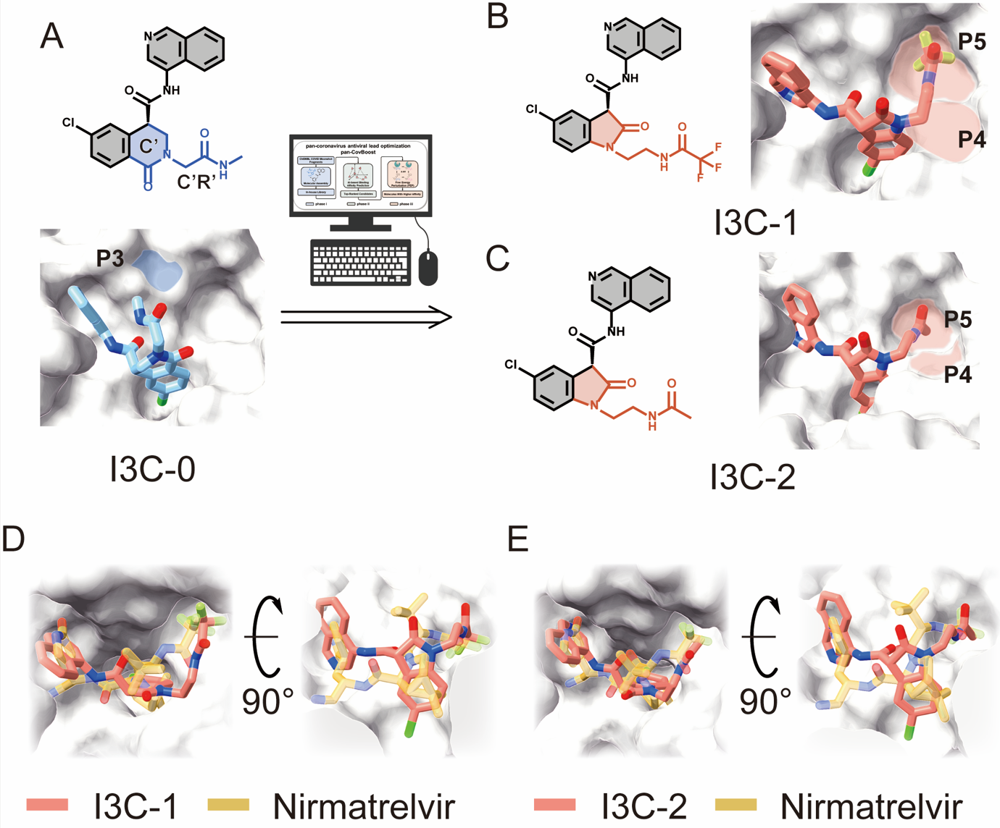
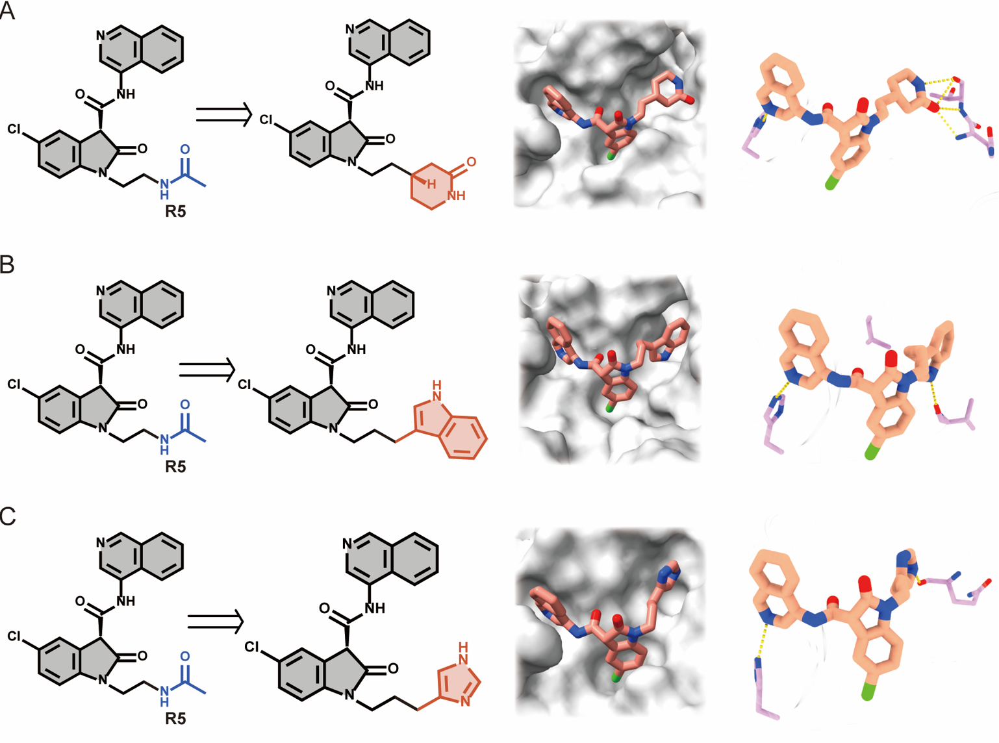
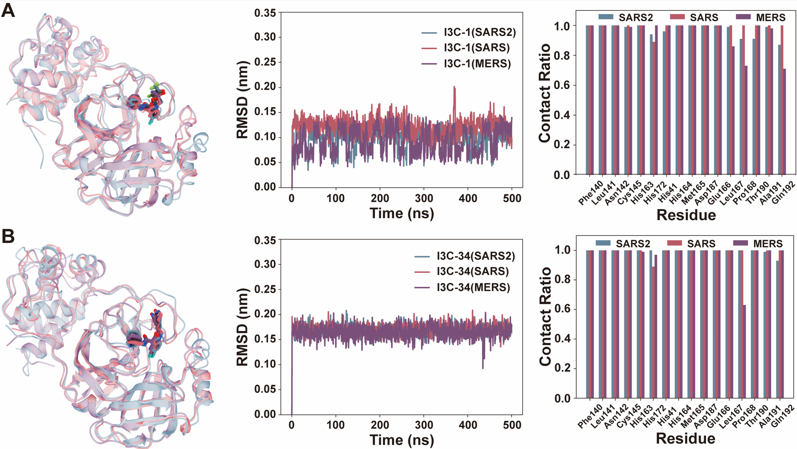

# SM_3CL_COVID-19
## 文章
Yang Y, Jiang Y, Zhang D, et al. Integrating Physics-Based Simulations with Data-Driven Deep Learning Represents a Robust Strategy for Developing Inhibitors Targeting the Main Protease[J]. Journal of Chemical Information and Modeling, 2025, 65(16): 8538-8548.
## FEP和深度学习双驱动的分子优化方法
该方法综合使用分子生成，深度学习打分以及FEP计算进行分子亲和力优化。具体软件代码见：https://github.com/yqyang733/Deep-CovBoost.git  

## 分子优化方法在主蛋白酶抑制剂优化中的应用
### 分子动力学模拟发现具有改造空间的基团

### 使用已有数据构建打分函数

### 第一轮优化结果

### 第一轮优化结果的机制解析

### 第二轮优化结果

### 潜在的广谱性分析
